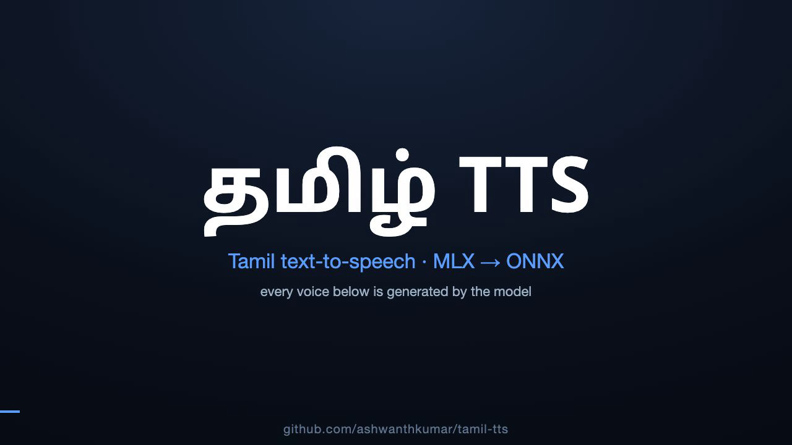

# tamil-tts (MLX)

Small, **CPU-friendly Tamil text-to-speech** — a single-speaker (female) voice trained on
**Apple Silicon with [MLX]**, exported to **ONNX**, with **Python** and **Rust** inference SDKs.
No GPU needed at inference; runs on any platform.

- **Acoustic model:** non-autoregressive, FastSpeech-2-style transformer (char-level Tamil → mel),
  trained from scratch in MLX on the Apple GPU. ~7.9M params; duration-predictor only (no
  pitch/energy variance adaptor), single fixed speaker, no style/emotion conditioning.
- **Vocoder:** HiFi-GAN (mel → waveform) — natural, non-robotic audio.
- **~33 MB** acoustic model + 56 MB vocoder, 22.05 kHz.

## 🔊 Demo

[](videos/intro.mp4)

▶ [Play the ~1 min demo](videos/intro.mp4) — model-narrated intro + voice samples, with English subtitles. Built with Remotion ([`videos/intro/`](videos/intro/)).

## Quick start

Download the model assets from the [latest release](https://github.com/ashwanthkumar/tamil-tts/releases/latest)
into `models/` (`tamil_ns.enc_dur.onnx`, `tamil_ns.decoder.onnx`, `hifigan.onnx`, `tamil_ns.tokenizer.json`), then:

**Python**
```bash
uv sync --extra train          # or: pip install onnxruntime numpy soundfile librosa
uv run python -m tamiltts.mlx.onnx_infer_ns -m models/tamil_ns --text "வணக்கம், இது தமிழ் பேச்சு." -o out.wav
```

**Rust**
```bash
cd rust
cargo run --release --example synthesize_ns -- "வணக்கம்" out.wav ../models/tamil_ns
```

**Speaking rate** — both SDKs take a `speed` multiplier (>1 faster/shorter, <1 slower/longer),
applied to predicted durations at inference (no retrain): `--speed 0.8` (Python) or a trailing
`1.25` arg (Rust). Explicit pitch/energy control is planned for v0.2.

The SDKs run `text → enc_dur → (length-regulate) → decoder → mel → hifigan → wav`, entirely on CPU.
`hifigan.onnx` (the neural vocoder) is required.

## How it works / reproduce it

- **Architecture + step-by-step reproduction on any MLX Mac** (data → aligner → train → ONNX →
  vocoder → SDKs), plus TensorBoard/remote setup: [`docs/MLX_RUNBOOK.md`](docs/MLX_RUNBOOK.md).
- **Model card:** [`docs/model_card.md`](docs/model_card.md).

## Model & licenses

- **The model is free to use under the [Apache-2.0 license](https://www.apache.org/licenses/LICENSE-2.0).**
- Trained ~20k steps in MLX on a 32 GB Mac. Single-speaker female Tamil voice; not a speaker cloner.
- **Training data:** [IndicTTS Tamil] — CC-BY-4.0 + IIT Madras Indic TTS EULA, attribution required
  (see [`docs/DATASET_LICENSE.md`](docs/DATASET_LICENSE.md)).
- **Vocoder weights:** HiFi-GAN [`jaketae/hifigan-lj-v1`](https://huggingface.co/jaketae/hifigan-lj-v1) (MIT).
- Code: MIT (see `LICENSE`).

[MLX]: https://github.com/ml-explore/mlx
[IndicTTS Tamil]: https://huggingface.co/datasets/SPRINGLab/IndicTTS_Tamil
